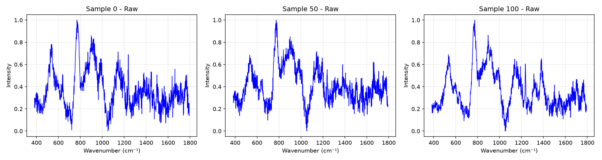
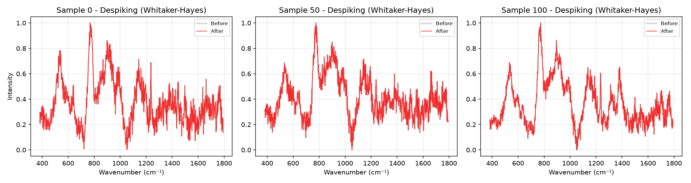
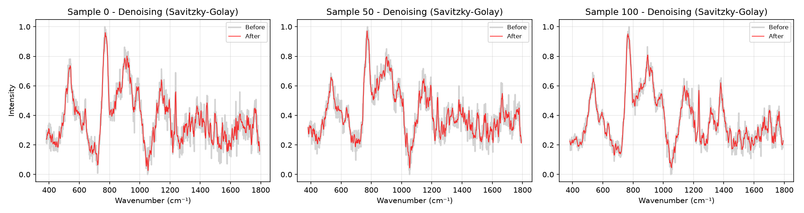
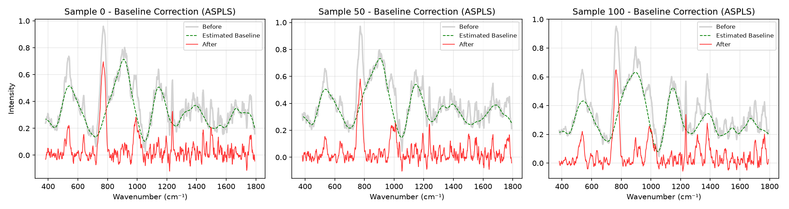
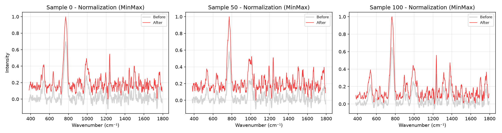

# Raman Spectra Preprocessing Pipeline

This document visualizes the effect of each preprocessing step on three example Raman spectra from the dataset (`X_test.npy`).
By overlaying the 'Before' and 'After' states, we can see exactly what each transformation does to the data. This visual analysis helps explain why the pipeline might be reducing classification accuracy compared to raw data (e.g., ASPLS struggling with already-normalized data).

## Raw Data

The original unprocessed Raman spectra. Note that the data in `X_test.npy` appears to already be min-max normalized (range 0 to 1).

## Despiking (Whitaker-Hayes)

Removes cosmic ray spikes from the spectrum.

## Denoising (Savitzky-Golay)

Smoothes the signal to reduce high-frequency noise.

## Baseline Correction (ASPLS)

Removes the fluorescent baseline background. Notice how it behaves on this dataset!

## Normalization (MinMax)

Scales the intensities to a fixed range (typically 0 to 1).

