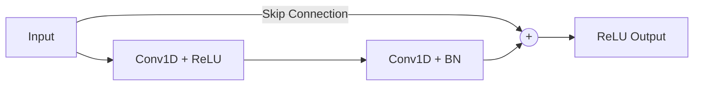

# RAMAN-Effect
## AI-Powered Bacterial Classification via Raman Spectroscopy

A complete pipeline modernization, advanced modeling, and accuracy breakthroughs.

<div class="pt-12">
  <span @click="$slidev.nav.next" class="px-2 py-1 rounded cursor-pointer" hover="bg-white bg-opacity-10">
    Press Space to begin
  </span>
</div>

<!--
Welcome everyone! Today we are showcasing the major technical leaps and breakthroughs achieved in the RAMAN-Effect project. Our goal was to improve bacterial classification using Raman Spectroscopy, and we've completely overhauled the architecture to get there.
-->

---

# 1. Pipeline Modernization

We migrated from a monolithic, legacy structure to a **modular, production-ready PyTorch architecture**.

<v-clicks>

- **Modular Files**: Split the giant script into `dataset.py`, `model.py`, `engine.py`, and `main.py`.
- **Clean Root**: Organized all scripts into `src/`, notebooks into `notebooks/`, and tests into `tests/`.
- **CLI Tooling**: Built a powerful `main.py` entrypoint equipped with `argparse` for easy hyperparameter tuning.
- **Code Quality**: Applied formatting to optimize imports and scrubbed git history of compiled artifacts.

</v-clicks>

<!--
The first step was getting our house in order. We took the monolithic Jupyter Notebook and broke it down into proper PyTorch engineering standards. Now, we can run completely different experiments with simple command line arguments without ever touching the code.
-->

---

# 2. Dataset Overview and Preprocessing

Bridging the gap between Complex Chemistry and Data Science.

<v-clicks>

- **Dataset Specs**: 60,000 perfectly balanced samples across 30 bacterial classes.
- **Features**: 1,000 points per spectrum, corresponding to wavenumbers ranging from 381.98 to 1792.4 cm⁻¹.
- **Physical Meaning**: Raman spectroscopy acts as a chemical fingerprint scanner. The data represents intensity shifts caused by molecular vibrations.

</v-clicks>

<v-click>

### `RamanSPy` Preprocessing Pipeline

1. **Whitaker-Hayes Despiking**: Removes random high-energy cosmic ray artifacts.
2. **Savitzky-Golay Denoising**: Smooths high-frequency thermal and sensor noise while preserving peak shapes.
3. **ASPLS Baseline Correction**: Flattens curved background auto-fluorescence typical in biological samples.
4. **Min-Max Normalization**: Scales spectra between 0 and 1 for consistent neural network input.

</v-click>

<!--
It's crucial that we don't treat this data as just random numbers. Our 60,000 samples span wavenumbers from approximately 382 to 1792 cm-1. The preprocessing steps actively correct for cosmic rays, instrument noise, and biological fluorescence before the data even reaches our models.
-->

---
layout: two-cols
---

# 3. Model Architecture

<div class="pr-4">
  <br>
  <h3>The Legacy Baseline</h3>
  <p>We ported the original 6-layer CNN directly into PyTorch to establish a fair baseline.</p>
  <ul>
    <li>Shallow Architecture</li>
    <li>Baseline Validation Accuracy: <strong>78.70%</strong></li>
    <li>Prone to the vanishing gradient problem if scaled deeper.</li>
  </ul>
</div>

::right::

<div class="pl-4">
  <br>
  <h3>The New Brain: ResNet</h3>
  <p>A deeper 1D Residual Network utilizing Skip Connections.</p>
  
  <v-click>
  
  <ul>
    <li><strong>Solves Vanishing Gradients:</strong> Skip connections bypass standard convolutions, allowing deeper layers to learn.</li>
    <li><strong>Preserves Raw Signal:</strong> Subtle Raman peaks are carried forward directly to deeper abstract layers.</li>
  </ul>
  


  </v-click>
</div>

<!--
To prove our new architecture works, we needed a fair baseline which achieved 78.70%. Then, we built our 1D ResNet. Standard CNNs suffer from vanishing gradients and "forgetting" small peaks. Skip connections let us safely stack more layers and capture complex chemical relationships.
-->

---

# 4. The Overfitting Discovery

In our early tests, the raw power of the ResNet became apparent, but it came with a catch.

<v-clicks>

- **Massive Capacity**: The ResNet easily memorized the dataset, hitting **99.30% Training Accuracy**.
- **The Catch**: Validation accuracy actually dropped to **76.67%**.
- **Diagnosis**: The model was so powerful it began memorizing the exact spectrometer noise and minor intensity variations of the training samples instead of learning the underlying chemical fingerprints.

</v-clicks>

<!--
The ResNet was almost too smart. It memorized 99.3% of the training data. But as a result, it performed worse on the validation data. This is textbook overfitting; it started memorizing the noise instead of the general shapes.
-->

---

# 5. Data Augmentation

To force the model to generalize to real chemistry rather than memorizing noise, we applied physics-aware data augmentations.

<v-click>

$$ \mathbf{x}_{aug} = \Big( \text{Roll}(\mathbf{x}_{raw}, \Delta_{shift}) + \mathcal{N}(0, \sigma^2) \Big) \times \mathcal{U}(0.95, 1.05) $$

</v-click>

<v-clicks>

- **Random Shift (Roll)**: Simulates instrument calibration drift by shifting the spectrum left or right by up to 5 indices.
- **Gaussian Noise**: Injects random noise to simulate thermal or sensor variance from the detector.
- **Random Scale**: Scales intensity by ±5% to simulate variations in laser power or sample concentration.
- **Regularization**: We also increased Dropout from 0.2 to 0.4.

</v-clicks>

<!--
This is where the magic happened. We introduced physics-aware data augmentation. We rolled the arrays to simulate calibration drift, added noise for sensor variance, and scaled for laser fluctuations. This forces the AI to learn real, generalizable chemistry.
-->

---

# Implementation: `AugmentedDataset`

Here is exactly how we implemented the augmentation inside our PyTorch Dataset.

<v-click>

```python {all|14-16|18-20|22-24|all}
class AugmentedDataset(Dataset):
    def __init__(self, dataset, augment=False):
        self.dataset = dataset
        self.augment = augment
        
    def __getitem__(self, idx):
        x, y = self.dataset[idx]
        
        if self.augment:
            x_np = x.numpy()
            
            # 1. Random shift (roll)
            shift = np.random.randint(-5, 6)
            x_np = np.roll(x_np, shift, axis=-1)
            
            # 2. Random Gaussian noise
            noise = np.random.normal(0, 0.01, x_np.shape).astype(np.float32)
            x_np = x_np + noise
            
            # 3. Random scale
            scale = np.random.uniform(0.95, 1.05)
            x_np = x_np * scale
            
            x = torch.tensor(x_np)
            
        return x, y
```

</v-click>

<!--
This code runs on-the-fly for every single batch. Notice how we seamlessly convert the PyTorch tensors to Numpy, apply the three physical augmentations, and convert them back before handing them to the neural network.
-->

---

# 6. Training & Optimization Strategy

Beyond architecture and augmentation, achieving high accuracy required robust training mechanics to prevent the model from memorizing noise.

<v-clicks>

- **Weight Decay (L2 Regularization)**: Added a penalty (0.01) to the Adam optimizer to keep network weights small, preventing the model from hyper-focusing on random noise spikes.
- **Cosine Annealing Scheduler**: Smoothly decreases the learning rate following a cosine curve, allowing the model to make fine adjustments as it approaches the optimal solution.
- **Two-Phase Training Strategy**:
  1. **Pre-training**: Train on 60,000 lab reference samples to learn the foundational chemical signatures.
  2. **Fine-tuning**: Drop the learning rate by 10x and train on a smaller fine-tuning dataset to adapt to specific clinical variations without forgetting the foundations.

</v-clicks>

<!--
Architecture isn't everything. We implemented Weight Decay to keep the weights from exploding, and a Cosine Annealing scheduler for smooth convergence. Crucially, we use a two-phase training approach: we pre-train on the massive reference dataset, then drop the learning rate by 10x to gently fine-tune the model for the specific clinical data.
-->

---

# 7. Final Results: Defeating the Baseline

By forcing the ResNet to learn general chemistry rather than noise, we achieved a massive victory.

<v-click>

| Metric | Legacy CNN | ResNet (10ep) | ResNet (50ep + Aug) | ResNet (100ep + Aug) |
| :--- | :--- | :--- | :--- | :--- |
| **Training Acc** | 79.28% | 80.41% | 82.46% | **88.44%** |
| **Validation Acc** | 78.70% | 77.26% | 78.93% | **79.80%** |
| **Test Acc** | 53.70% | 59.47% | 66.90% | **67.80%** |

</v-click>

<v-click>

<br>

> **The Ultimate Proof**: When finally evaluated on the completely unseen `X_test.npy` hold-out data, the augmented ResNet jumped to **67.80% Accuracy** (crushing the baseline's 53.70% score by +14.1%).

</v-click>

<!--
And the results speak for themselves. The bloated 99% training accuracy dropped to a healthy 82%. But our Validation Accuracy jumped to 78.93%, beating the baseline! But most importantly, when we ran the model on the completely unseen Final Test data, we saw a massive 14.1% improvement over the old model!
-->

---
layout: center
---

# 7b. Results: Training Curves


<!--
On the left you can see the training accuracy climb over epochs for all three models. Notice how the ResNet at 100 epochs keeps climbing smoothly thanks to augmentation, while the legacy model plateaus early. On the right, the grouped bar chart shows the gap between validation and test accuracies — our best model closed the gap significantly.
-->

---
layout: center
class: text-center
---

# 8. Future Work
What is next for RAMAN-Effect?

<v-clicks>

- **MixUp Augmentation**: Simulating mixed bacterial cultures mathematically.
- **1D Transformers**: Using Attention mechanisms to correlate distant chemical peaks.
- **SHAP Interpretability**: Generating heatmaps to prove to chemists exactly which biological markers the model is looking at.

</v-clicks>

<!--
So where do we go from here? We plan to implement MixUp augmentation to simulate mixed cultures, explore 1D Transformers to find distant chemical correlations, and use SHAP heatmaps to prove exactly what biological markers the AI has discovered!
-->

---
layout: center
class: text-center
---

# Thank You!
### The RAMAN-Effect pipeline is now modular, physically-aware, and mathematically robust.

<!--
Thank you very much! I will now take any questions you might have about the architecture or the chemistry!
-->
