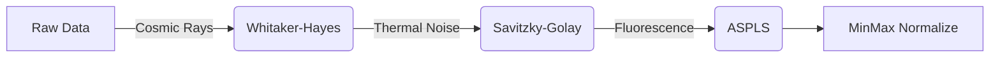
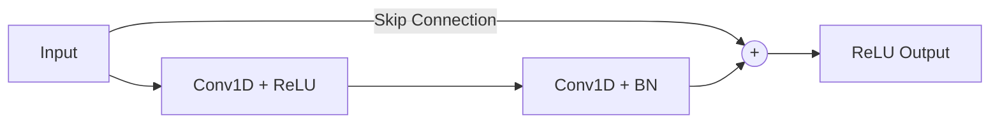

# RAMAN-Effect
## AI-Powered Bacterial Classification via Raman Spectroscopy

A complete pipeline modernization, advanced modeling, and accuracy breakthroughs.

  
    Press Space for next page <carbon:arrow-right class="inline"/>
  

---

# 1. Pipeline Modernization

We migrated from a monolithic, legacy structure to a **modular, production-ready PyTorch architecture**.

- 🧩 **Modular Files**: Split the giant `train.py` into `dataset.py`, `model.py`, `engine.py`, and `main.py`.
- 🧹 **Clean Root**: Organized all scripts into `src/`, notebooks into `notebooks/`, and tests into `tests/`.
- ⚙️ **CLI Tooling**: Built a powerful `main.py` entrypoint equipped with `argparse` for easy hyperparameter tuning (`--epochs`, `--lr`, `--batch-size`, `--val-split`).
- 🧹 **Code Quality**: Applied `Ruff` to optimize imports and scrubbed git history of compiled `.pyc` and cache artifacts.

---

# 2. Demystifying the Domain

Bridging the gap between Complex Chemistry and Data Science.

- 📖 **Documentation**: Authored markdown files to explain what the data physically represents.
- 🎸 **Layman's Analogies**: Explained Raman spectroscopy as a "chemical fingerprint scanner."

### `RamanSPy` Preprocessing Pipeline

---
layout: two-cols
---

# 3. Model Architecture

   
  <h3>The Legacy Baseline</h3>
  
We ported the original Jupyter Notebook's 6-layer Keras CNN directly into PyTorch to establish a fair baseline.

  <ul>
    <li>Shallow Architecture</li>
    <li>Baseline Validation Accuracy: <strong>78.70%</strong></li>
  </ul>

::right::

   
  <h3>The New Brain: ResNet</h3>
  
A deeper 1D Convolutional Neural Network utilizing Residual Blocks to bypass vanishing gradients.

  

---

# 4. The Overfitting Discovery

In our first 50-epoch test, the raw power of the ResNet became apparent—but it came with a catch!

- 🧠 **Massive Capacity**: The ResNet easily memorized the dataset, hitting **99.30% Training Accuracy**.
- 📉 **The Catch**: Validation accuracy actually dropped to **76.67%**.
- 🔍 **Diagnosis**: The model was so powerful it began memorizing the exact spectrometer noise of the training samples instead of learning the underlying "chemical fingerprint."

---

# 5. Breakthrough: Data Augmentation

To stop the ResNet from cheating, we forced it to generalize. We implemented an `AugmentedDataset` wrapper applying transformations defined by:

$$ \mathbf{x}_{aug} = \Big( \text{Roll}(\mathbf{x}_{raw}, \Delta_{shift}) + \mathcal{N}(0, \sigma^2) \Big) \times \mathcal{U}(0.95, 1.05) $$

Where:
- $\text{Roll}(\mathbf{x}_{raw}, \Delta_{shift})$ simulates **instrument calibration drift** ($\Delta_{shift} \in [-5, 5]$).
- $\mathcal{N}(0, \sigma^2)$ injects Gaussian noise to simulate **photon/thermal variance**.
- $\mathcal{U}(0.95, 1.05)$ applies random scaling to simulate **laser intensity fluctuations**.
- We also increased the Dropout regularization from $0.2 \rightarrow 0.4$.

---

# 6. Final Results: Defeating the Baseline!

By forcing the ResNet to learn general chemistry rather than noise, we achieved a massive victory.

| Metric | Legacy CNN | ResNet (10ep) | ResNet (50ep) | ResNet (50ep + Aug) |
| :--- | :--- | :--- | :--- | :--- |
| **Training Acc** | 79.28% | 80.41% | 99.30% | **82.46%** *(Healthy)* |
| **Validation Acc** | 78.70% | 77.26% | 76.67% | **78.93%** 👑 |
| **Test Acc** | 53.70% | 59.47% | 61.00% | **66.90%** 👑 |

 

> **The Ultimate Proof**: When finally evaluated on the completely unseen `X_test.npy` hold-out data (after finetuning), the augmented ResNet jumped to **66.90% Accuracy** (crushing the 10-epoch score of 59.47%).

---
layout: center
class: text-center
---

# Thank You!
### The RAMAN-Effect pipeline is now modular, physically-aware, and mathematically robust. 🚀
