# Raman Spectra Preprocessing Pipeline Visualizations

This folder contains individual visualizations of the effect of each preprocessing step on three example Raman spectra from the dataset (`X_test.npy`).
By overlaying the 'Before' and 'After' states, we can see exactly what each transformation does to the data.

## Raw Data

The original unprocessed Raman spectra.

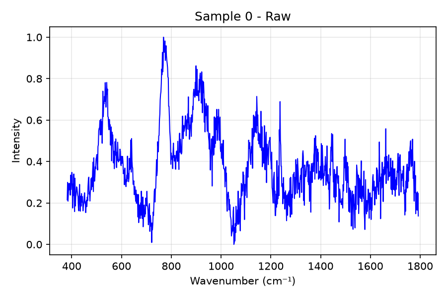

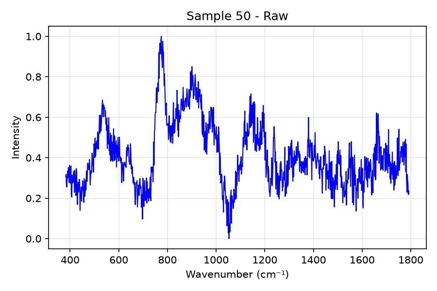

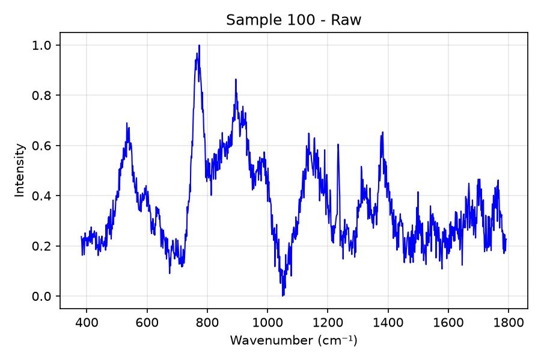

## Despiking (Whitaker-Hayes)

Removes cosmic ray spikes from the spectrum.

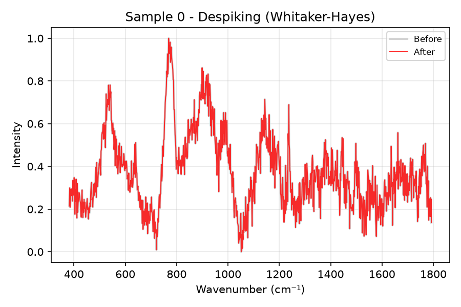

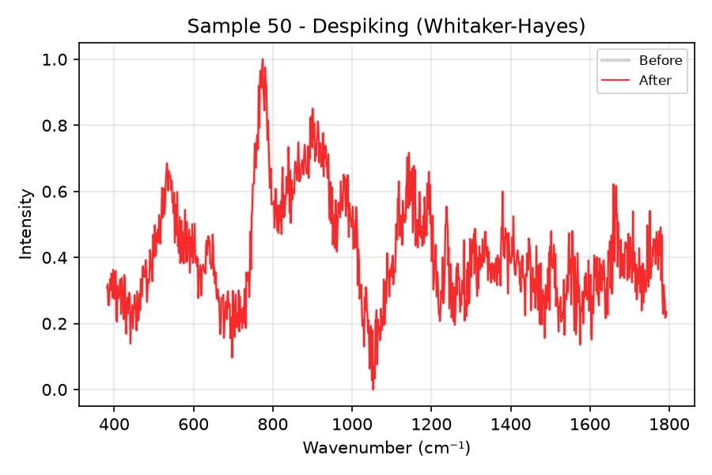

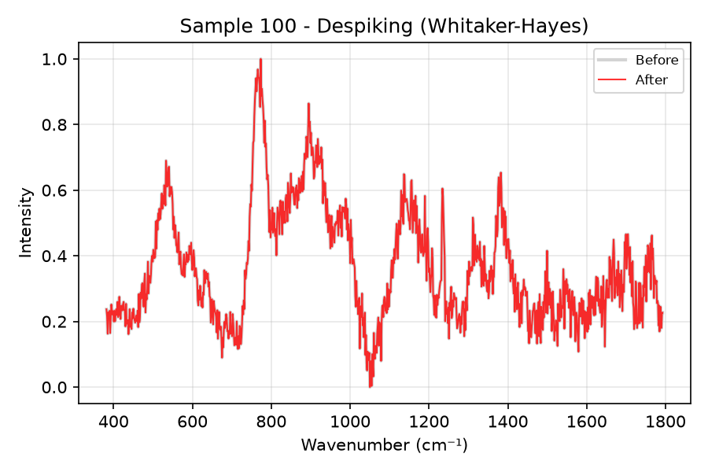

## Denoising (Savitzky-Golay)

Smoothes the signal to reduce high-frequency noise.

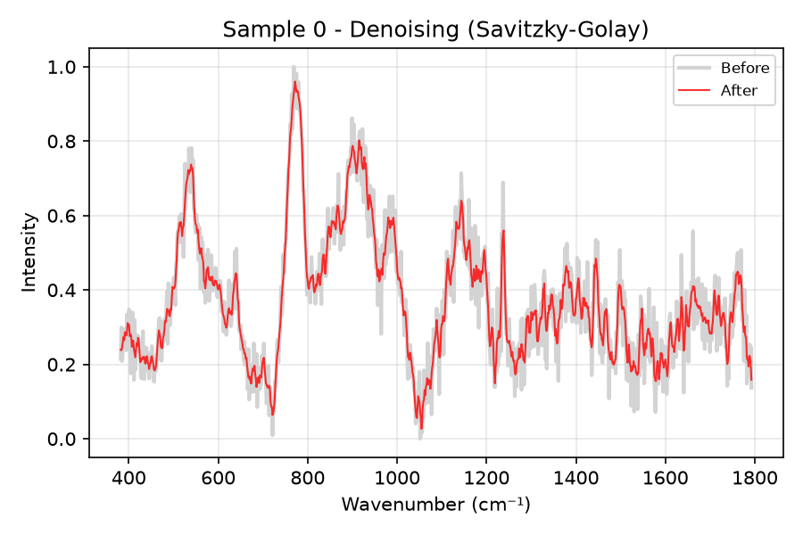

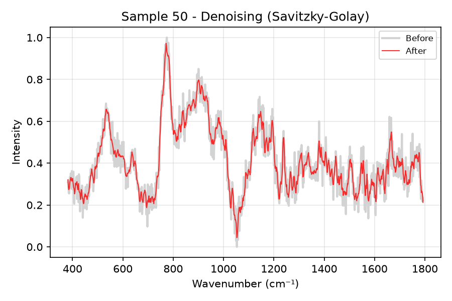

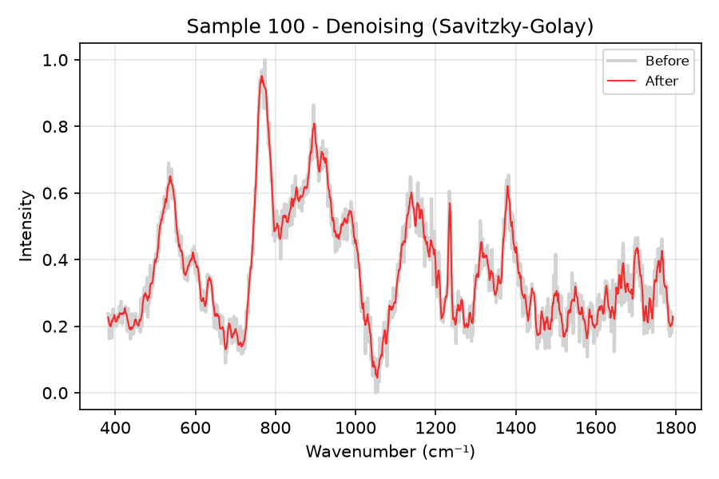

## Baseline Correction (ASPLS)

Removes the fluorescent baseline background. Notice how it behaves on this dataset!

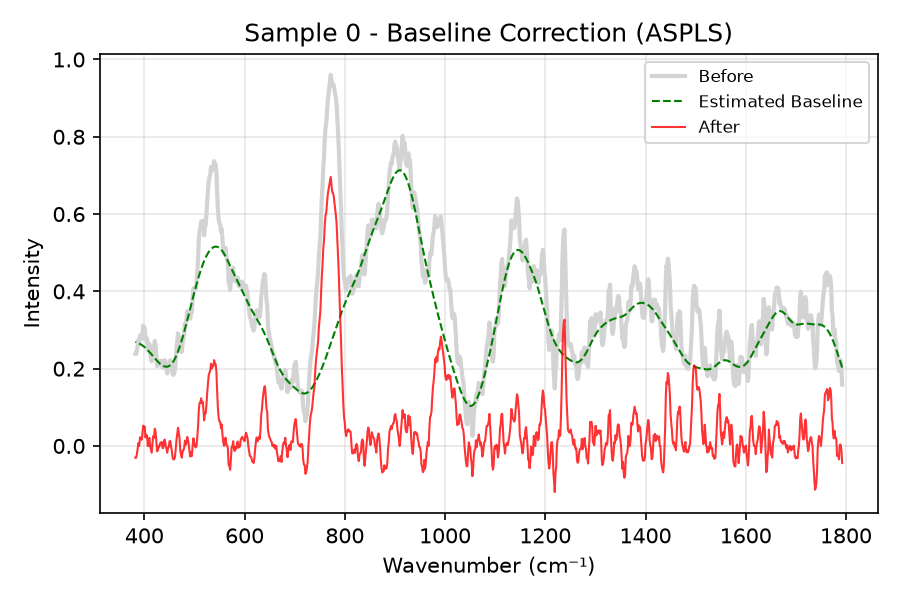

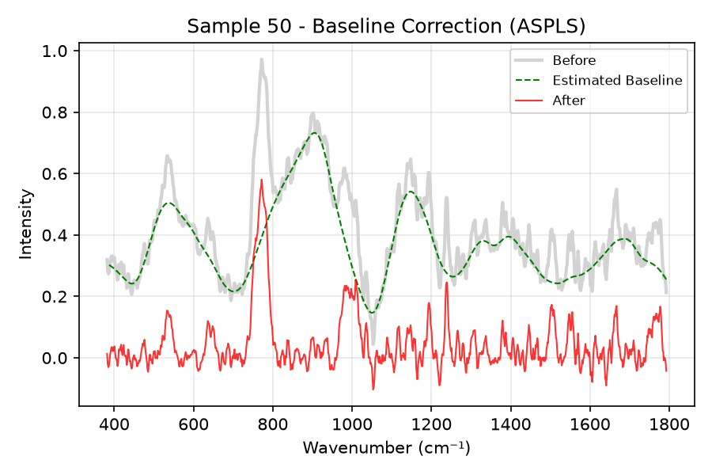

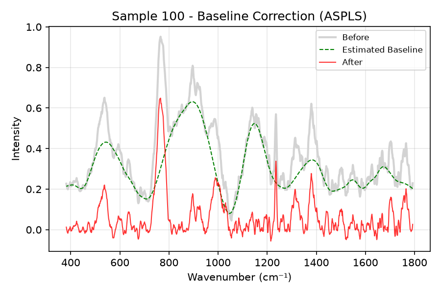

## Normalization (MinMax)

Scales the intensities to a fixed range (typically 0 to 1).

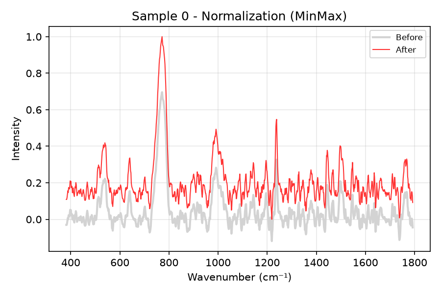

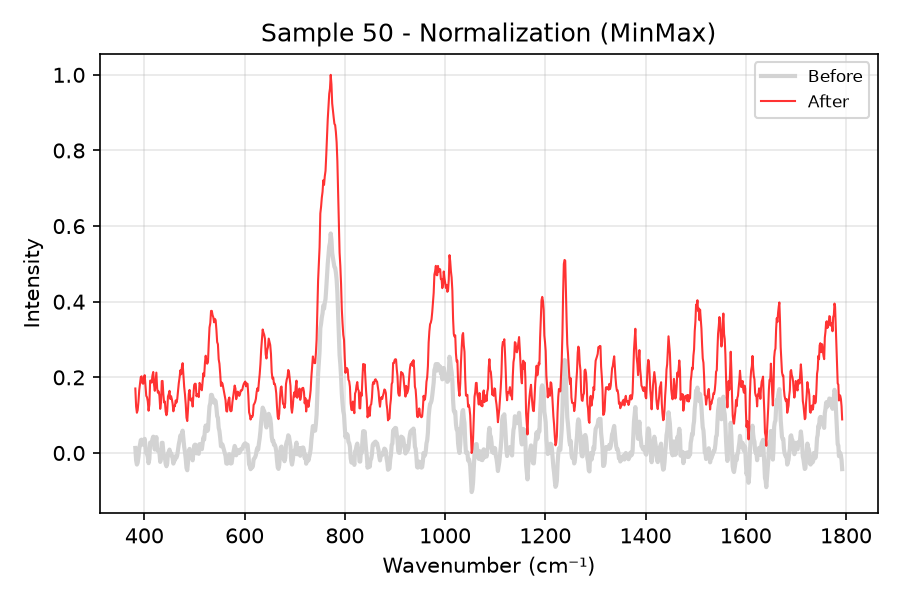

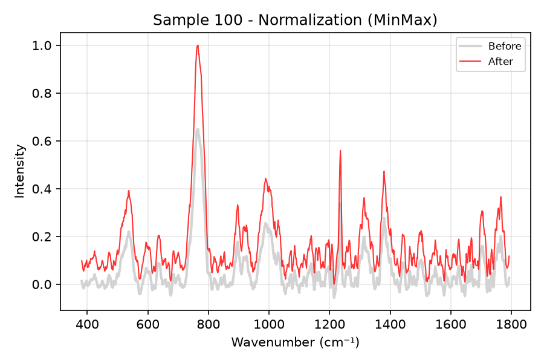

