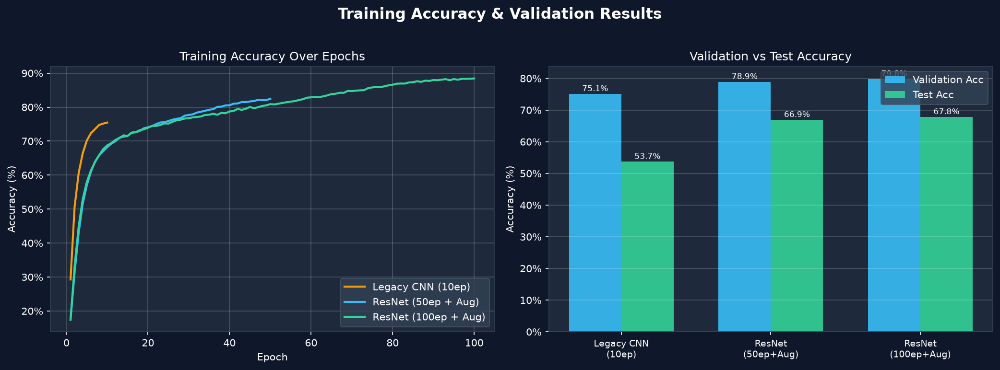

# Interactive Training Dashboard

To track and compare our extensive list of experiments, we built a local **Streamlit Web Application**. This tool parses raw output logs and plots training metrics dynamically.

## Features
- **Dynamic Log Parsing:** Automatically reads the `.log` files from the `results/` directory using Regex.
- **Interactive Visualization:** Plots multi-line charts using `plotly.express` for both Loss and Accuracy, allowing zooming and tooltip inspection.
- **Direct Comparison:** Allows selecting multiple models from a dropdown to compare their learning trajectories over time.

## Screenshot of Training Loss Curves


## Code Snippet: Log Parsing logic
```python
def parse_log_file(filepath):
    # Regex to match lines like:
    # Pre-train Epoch: 1 [38400/40200 (95%)]	Loss: 2.829866	Acc: 12.76%
    pattern = re.compile(r"Epoch:\s*(\d+).*?Loss:\s*([\d\.]+).*?Acc:\s*([\d\.]+)%")
    
    epochs_data = {}
    current_phase_offset = 0
    last_epoch = 0
    with open(filepath, 'r') as f:
        for line in f:
            match = pattern.search(line)
            if match:
                epoch = int(match.group(1))
                loss = float(match.group(2))
                acc = float(match.group(3))
                
                if epoch < last_epoch:
                    current_phase_offset += last_epoch
                    
                continuous_epoch = epoch + current_phase_offset
                epochs_data[continuous_epoch] = {'Loss': loss, 'Accuracy': acc}
                last_epoch = epoch
                
    if not epochs_data:
        return pd.DataFrame()
        
    df = pd.DataFrame.from_dict(epochs_data, orient='index')
    df.index.name = 'Epoch'
    df.sort_index(inplace=True)
    return df
```
