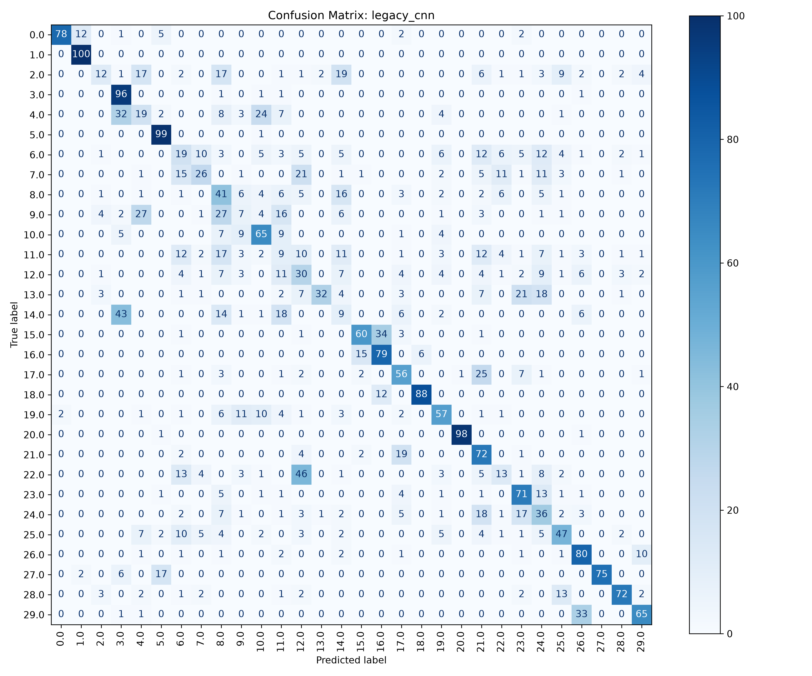
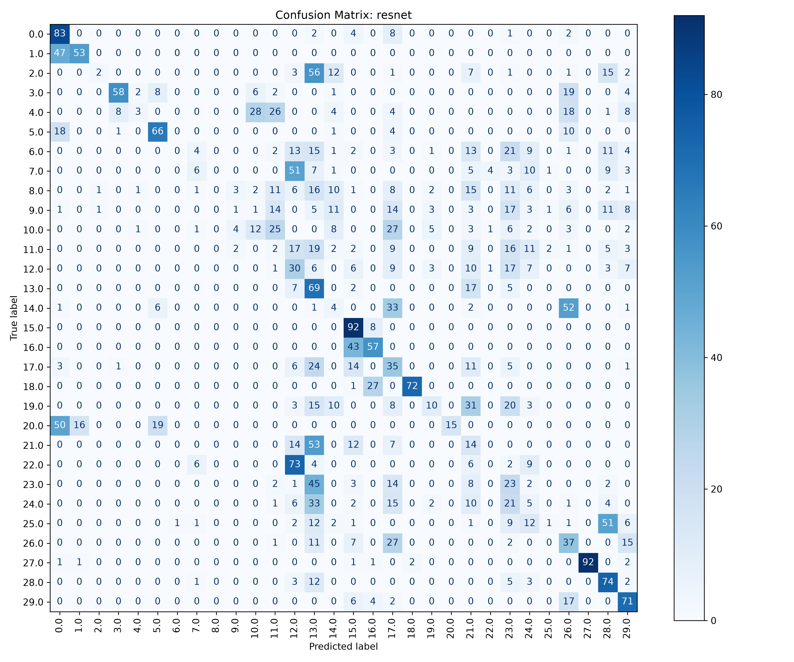
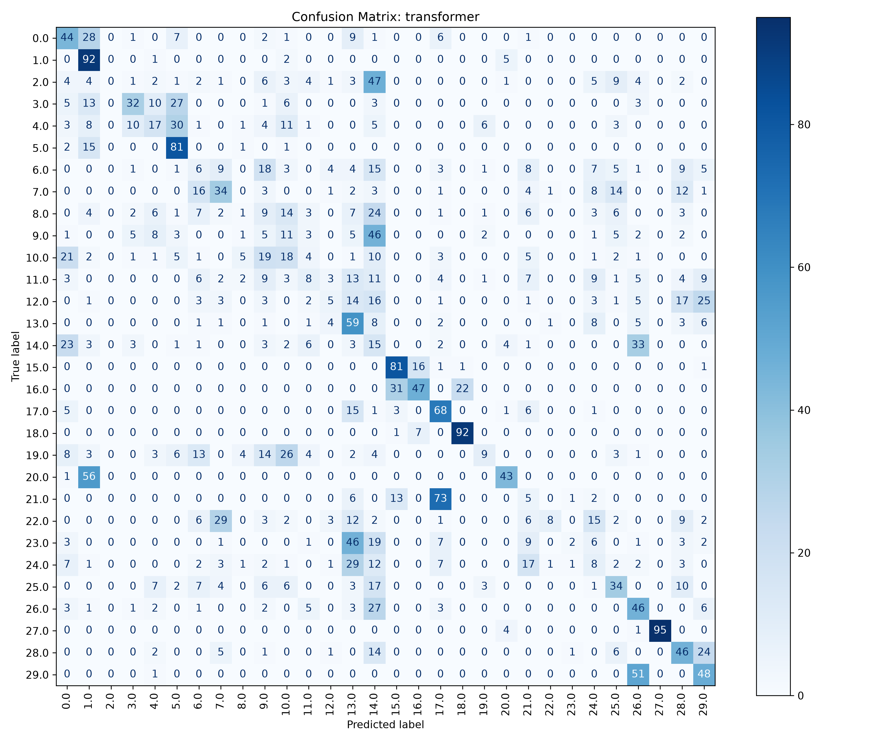

# Evaluation & Validation

To ensure our findings were robust and our Champion model performed consistently, we implemented stringent evaluation metrics and cross-validation pipelines.

## K-Fold Cross Validation
We implemented a 5-Fold cross-validation script to evaluate fine-tuning reliability across different splits of the dataset.

```python
    for fold in range(1, 6):
        print(f"\n>>> Starting Fold {fold}/5 <<<")
        # Load fresh pre-trained weights
        model = get_model()
        model.load_state_dict(torch.load(ref_model_path, weights_only=True))
        
        # New random split for finetuning
        ft_train, ft_val = random_split(finetune_dataset, [ft_train_size, ft_val_size])
        ft_train_loader = DataLoader(ft_train, batch_size=args.batch_size, shuffle=True)
        ft_val_loader = DataLoader(ft_val, batch_size=args.batch_size*2, shuffle=False)
        
        # ... finetuning loop ...
        
        # Evaluate on testing set
        model.load_state_dict(best_ft_weights)
        _, test_acc = evaluate(model, device, test_loader, criterion, phase=f"Fold {fold} Test")
        test_accuracies.append(test_acc)
```

## Confusion Matrix Heatmaps
We developed a script to render confusion matrices for all model architectures to visually inspect where classification errors occurred between the 30 bacterial classes.

### Legacy CNN (Champion)


### ResNet


### Transformer

